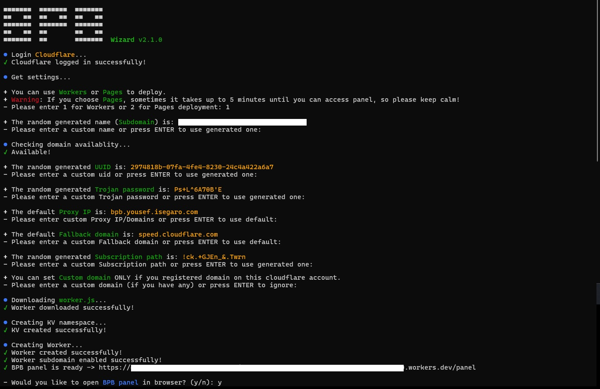

<h1 align="center">💦 BPB Wizard</h1>

This project aims to facilitate the deployment and management process of [BPB Panel](https://github.com/bia-pain-bache/BPB-Worker-Panel) and prevent user mistakes during deployments. It supports both Workers and Pages methods and is highly recommended to use.

<p align="center">
  
</p>
<br>

## 💡 How to use

### 1. Cloudflare account

To use this method, all you need is a Cloudflare account. You can [sign up here](https://dash.cloudflare.com/sign-up/), and don’t forget to check your email afterward to verify your account.

### 2. Install or modify BPB Panel

> [!WARNING]
> If you're connected to a VPN, disconnect it.

#### Windows - macOS

Based on your operating system, [download the ZIP file](https://github.com/bia-pain-bache/BPB-Wizard/releases/latest), unzip it, and run the program.

#### Android (Termux) - Linux

Android users who have Termux installed on their device and Linux users can use this bash:

```bash
bash <(curl -fsSL https://raw.githubusercontent.com/bia-pain-bache/BPB-Wizard/main/install.sh)
```

> [!IMPORTANT]  
> Be sure to download and install Termux only from its [official source](https://github.com/termux/termux-app/releases/latest). Installing via Google Play might cause issues.

The first question asks whether you want to create a new panel or modify existing panels in the account.

Then logs into your Cloudflare account, return to the terminal and asks you a series of questions.

If you choose option 1, it will ask a series of configuration questions. You can use the default values or input your own. In the end, it opens the panel for you in your browser — that’s it.

> [!TIP]
> For each setting it asks about, it has already generated a secure, personal value for you. You can simply press Enter to accept it and move on to the next question, or input your own values.

If you choose option 2, it lists deployed Workers and Pages projects and you can choose which one to modify.

## Updating Panel

Just run wizard and select option 2 for the first question. It will show you a list of project names in your account — you can choose any to update to the latest stable version or delete.
